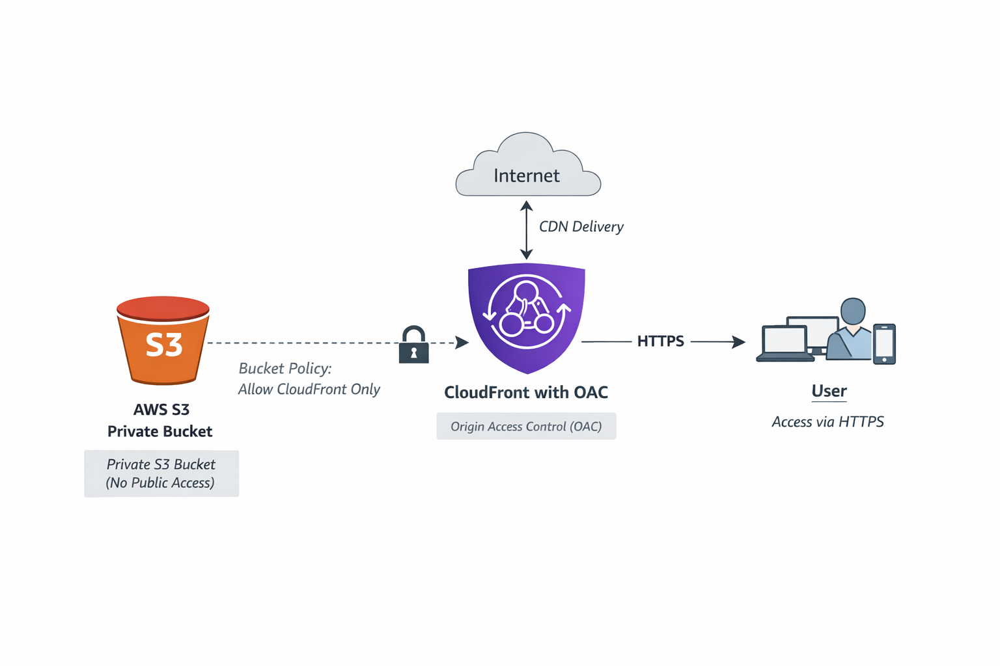

# Secure Static Website with S3 + CloudFront (Terraform)

This project deploys a **secure static website** on AWS using **Amazon S3** and **Amazon CloudFront**, fully managed with **Terraform**.

The S3 bucket is **private** and **not publicly accessible**. CloudFront accesses the bucket securely using **Origin Access Control (OAC)** and **SigV4 signing**.

---

## 🏗️ Architecture Overview



```
User (HTTPS)
    ↓
CloudFront Distribution (OAC + SigV4)
    ↓ 
Private S3 Bucket
```

### Key Security Features
- ✅ S3 bucket **fully private**
- ✅ Public access **blocked at bucket level**
- ✅ Access allowed **only from CloudFront**
- ✅ HTTPS enforced via CloudFront
- ✅ No direct S3 access possible

---

## 📁 Project Structure

```
.
├── TerraformCode/
│   ├── backend.tf
|   ├── main.tf
|   ├── output.tf
│   ├── providers.tf
│   └── variable.tf
├── www/
│   ├── index.html
│   ├── style.css/
│   ├── script.js/
└── README.md
```

---

## 📦 Resources Created

### S3
- `aws_s3_bucket`
- `aws_s3_bucket_public_access_block`
- `aws_s3_bucket_policy`
- `aws_s3_object` (uploads website files)

### CloudFront
- `aws_cloudfront_distribution`
- `aws_cloudfront_origin_access_control`

---

## 🔐 Security Model

### S3 Bucket
- All public access blocked
- No public ACLs or policies
- Only CloudFront service is allowed to read objects

### CloudFront OAC
- Uses **SigV4 signing**
- Replaces legacy Origin Access Identity (OAI)
- Recommended by AWS (modern & secure)

### Bucket Policy
Access is restricted using:
- Service principal: `cloudfront.amazonaws.com`
- Condition: CloudFront distribution ARN

---

## 🚀 Deployment Instructions

### 1️⃣ Prerequisites
- AWS CLI configured
- An AWS account

### 2️⃣ Initialize Terraform
```bash
terraform init
```

### 3️⃣ Review the Plan
```bash
terraform plan
```

### 4️⃣ Deploy Infrastructure
```bash
terraform apply
```

Confirm with `yes` when prompted.

---

## 🌍 Accessing the Website

After deployment, Terraform will output:

```
cloudfront_domain_name = xxxxxxxx.cloudfront.net
```

Open this URL in your browser:
```
https://xxxxxxxx.cloudfront.net
```

✅ Your static website is live and secure.

---

## 🧪 Uploading Content

All files inside the `www/` directory are automatically uploaded to S3:

- HTML
- CSS
- JavaScript

Terraform automatically sets the correct **Content-Type** based on file extension.

To update content:
1. Modify files in `www/`
2. Run:
```bash
terraform apply
```

---

## ⚠️ Notes & Best Practices

- CloudFront distributions take **5–15 minutes** to deploy
- Use Cache Policies for advanced setups
- Use ACM + custom domain for production websites

---

## 🧹 Cleanup

To destroy all resources:
```bash
terraform destroy
```

⚠️ This will permanently delete the S3 bucket and all objects.

---

## 📚 References

- AWS S3 Static Websites
- CloudFront Origin Access Control (OAC)
- Terraform AWS Provider Documentation

---

## 👨‍💻 Author

Created as a **learning & portfolio project** demonstrating:
- Infrastructure as Code (IaC)
- Secure AWS architecture
- Terraform best practices
